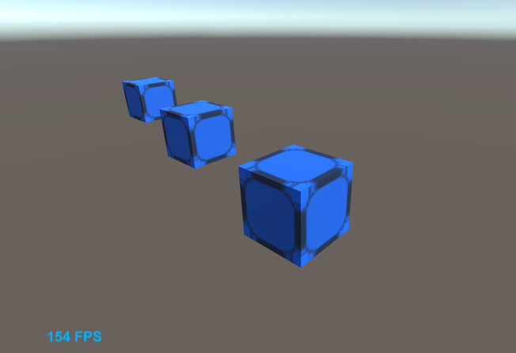

# WA vs ASM



## About the tool

This is a simple test tool that provides means to compare in realtime the rendering performance of webgl apps when using Web Assembly instead of asm.js. It features a 3D scene with cubes. To simulate high computational load it uses a custom animated CG shader that has its parameter values changed on every frame.

## How to use it

Host the Build folder on an http server (either a web one or a local one like https://www.npmjs.com/package/http-server). then open it through a modern browser (e.g. Chrome, Firefox) and browse to WA/index.html 

When the page is launched you'll see at the bottom left an FPS counter that shows the current frames per second. The higher this number is the better. Then you can switch to the ASM version by clicking on the "Switch to asm.js" link at the top of the page. When the asm version loads you can observe its performance again through the FPS counter. You can switch between ASM and WA to see the difference.

note: if you are running the tool on powerful hardware you might hit the 60 FPS default browser cap for webgl apps. In that case, you can run your browser with the needed flags to disable vsync. e.g. for chrome this is --disable-gpu-vsync

## How to extend the tool

This tool was built using the Unity 3D game engine. You can Unity 2018.3.3 or greater is needed to open and build the project.

The custom shader is called "hex.shader" and can be found under Assets\Shaders

You can customize its parameters.

```
Shader "Custom/hex"
{
    Properties
    {
        _Color ("Color", Color) = (1,1,1,1)
        _MainTex ("Albedo (RGB)", 2D) = "white" {}
        _Glossiness ("Smoothness", Range(0,1)) = 0.5
        _Metallic ("Metallic", Range(0,1)) = 0.0
        _Seed ("Seed", Range(0,1)) = 0.2
    }
```

Or you could change the way its parameters are updated every frame in Animator.cs located under Assets\Scripts

```
    void Update() {
        float seed = Mathf.PingPong(Time.time, 1.0F);
        cube.material.SetFloat("_Seed", seed);
    }
```

## Future plans for enhancements:

* Automate the build process so that both the WA and ASM builds are carried at the same time through a shell script and the necessary links are added as well
* Add UI buttons to dynamically change the number of cubes in the scene
* Add more shaders and UI options to switch between them at runtime